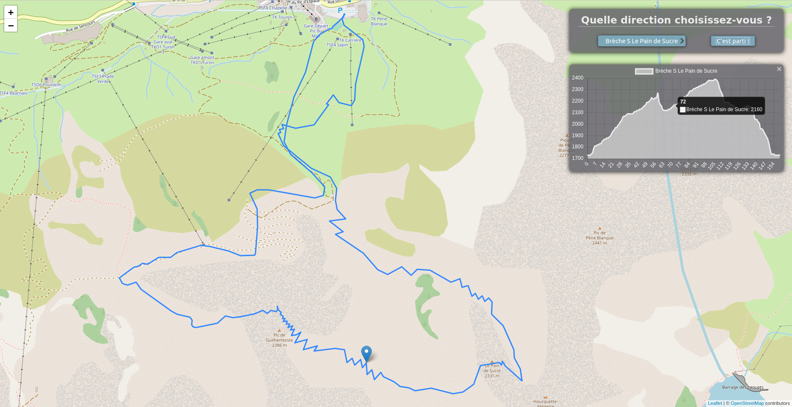

# web Projet : Réalisation d’une interface de visualisation de tracés GPS

Avec cette application vous pouvez charger sur une carte des tracés GPS de randonnées proposées et de visualiser leurs profils altimétriques. Le fait de déplacer la souris sur le profil altimétrique montre l’emplacement exact sur le tracé.

